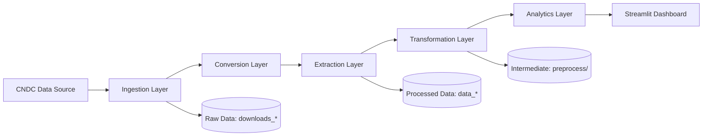

# Ende Dashboard

## Overview

**Ende Dashboard** is a modular **ETL pipeline and data visualization platform** built in Python for analyzing electricity market data from the **CNDC (Comité Nacional de Despacho de Carga)**.

The system is designed for **reproducible data workflows**, enabling automated ingestion, transformation, and visualization of energy market datasets through an interactive **Streamlit dashboard**.

It follows a **layered ETL architecture** suitable for analytics engineering, research, and production-grade data pipelines.

---

## Key Features

* Automated ingestion of CNDC datasets
* Modular ETL pipeline (ingestion → conversion → extraction → transformation)
* Structured data processing for generation and distribution systems
* Interactive dashboard built with **Streamlit + Plotly/Altair**
* Reproducible workflows with deterministic outputs
* Dockerized environment for portability and deployment
* Scalable design for future integration (APIs, orchestration, cloud)

---

## Architecture

The project follows a layered ETL architecture:



---

## Project Structure

```
ende_dashboard/
│
├── dis_01_import_cndc.py
├── dis_02_convert.py
├── dis_03_extract_*.py
│
├── gen_01_import_cndc.py
├── gen_02_convert.py
├── gen_03_extract_*.py
│
├── downloads_*/        # Raw CNDC data
├── data_*/             # Processed datasets
├── preprocess/         # Intermediate transformations
│
├── app.py              # Streamlit dashboard
├── requirements.txt
├── Dockerfile
└── README.md
```

---

## Requirements

* Python 3.12+
* pandas, numpy, requests
* openpyxl, pyarrow
* streamlit
* plotly, matplotlib, altair

Install dependencies:

```bash
pip install -r requirements.txt
```

---

## Setup

```bash
python -m venv .venv
source .venv/bin/activate
pip install -r requirements.txt
```

---

## Usage

### Run ETL Pipelines

**Distribution pipeline:**

```bash
python dis_01_import_cndc.py
```

**Generation pipeline:**

```bash
python gen_01_import_cndc.py
```

---

### Launch Dashboard

```bash
streamlit run app.py
```

Access locally:

```
http://localhost:8501
```

---

## Testing

```bash
pytest -v
```

---

## Docker Deployment

### Build image

```bash
docker build -t ende_dashboard .
```

### Run dashboard

```bash
docker run --rm -p 8501:8501 ende_dashboard
```

### Run pipeline inside container

```bash
docker run -it ende_dashboard bash
python dis_01_import_cndc.py
```

---

## Data Pipeline Design

The pipeline is structured into deterministic stages:

1. Data ingestion from CNDC sources
2. File conversion (Excel, ZIP, CSV normalization)
3. Structured data extraction
4. Data cleaning and transformation
5. Aggregation and analytics preparation
6. Visualization via Streamlit dashboard

This design ensures:

* Reproducibility
* Modular extensibility
* Clear separation of concerns
* Easy debugging and testing

---

## Output Zones

| Layer       | Description                   |
| ----------- | ----------------------------- |
| downloads_* | Raw ingested CNDC files       |
| preprocess  | Intermediate transformed data |
| data_*      | Final structured datasets     |

---

## Development

To extend the project:

```bash
mkdir tests
pytest -v
```

Recommended improvements:

* Add schema validation
* Improve logging and monitoring
* Introduce pipeline orchestration (Airflow / Prefect)
* Add CI/CD (GitHub Actions)

---

## Notes

* Requires internet connection for CNDC data ingestion
* Designed for batch processing workloads
* Optimized for local + containerized execution

---

## Contributing

Contributions are welcome in:

* ETL optimization
* Data quality validation
* Dashboard UX improvements
* Performance and scalability improvements
* Documentation enhancements

---

## License

DICD

---


